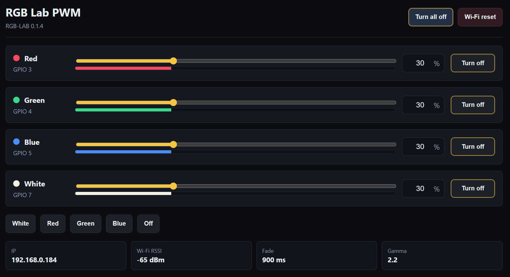
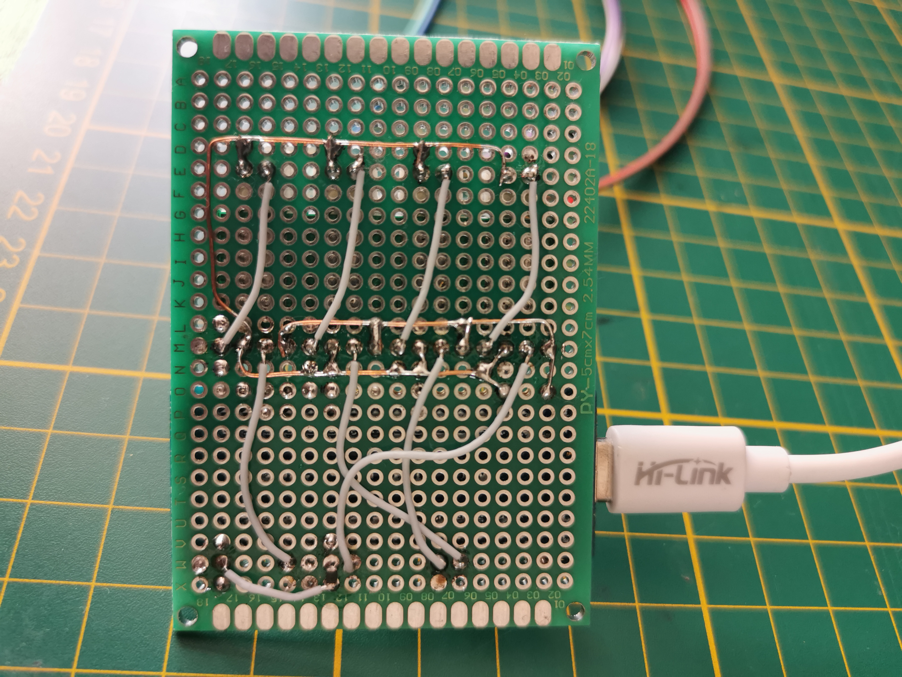
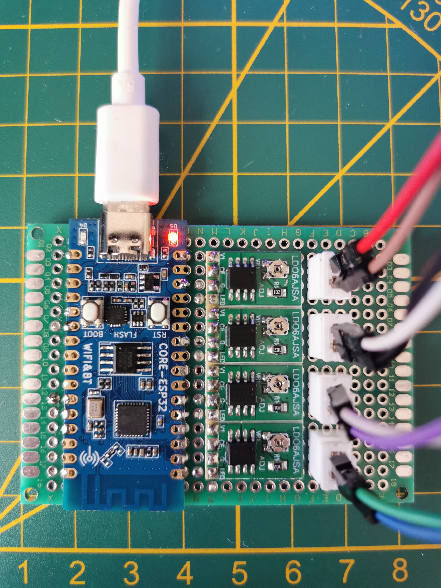
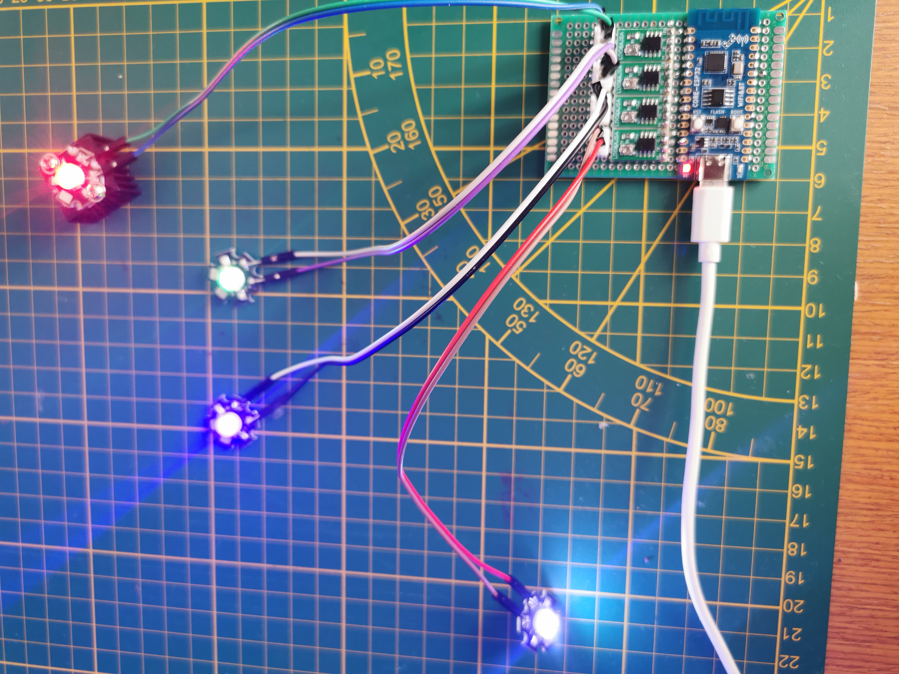

# RGBW PWM ESP32-C3 Controller

A Wi-Fi RGBW PWM controller for four LDO6AJSA/LD06AJSA constant-current LED driver modules based on the CN5711 chip.

## Features

- dark web UI for phone and desktop control
- connects to an existing Wi-Fi network, so the phone or PC stays online
- Wi-Fi setup portal named `RGB-LAB-SETUP`, with no Wi-Fi credentials stored in source code
- four channels: red, green, blue and white
- slider and numeric input for 0-100 % brightness
- separate `Turn on` / `Turn off` buttons for each channel
- master `Turn all on` / `Turn all off` button
- smooth linear fades when changing brightness or enabling/disabling channels
- gamma-corrected PWM for more natural perceived brightness
- last state is stored in flash memory
- Wi-Fi status LED: solid when connected, blinking in setup AP mode
- captive portal responses for easier Wi-Fi setup on mobile devices

## Project Photos

### Web Interface



The browser UI exposes four independent RGBW channels, per-channel enable buttons, a master switch, presets, Wi-Fi status and the active GPIO mapping.

### Prototype Hardware



Bottom side of the prototype perfboard with hand-wired power and PWM signal routing.



LuatOS ESP32-C3 board and four LD06AJSA/CN5711 current driver modules mounted on a prototype board.



RGBW high-power LEDs running from the assembled controller during a functional test.

## Recommended Pins on the LuatOS ESP32-C3 Board

| Signal | GPIO | Board pin |
| --- | ---: | ---: |
| PWM_R | GPIO3 | pin 20 |
| PWM_G | GPIO4 | pin 28 |
| PWM_B | GPIO5 | pin 27 |
| PWM_W | GPIO7 | pin 23 |
| WIFI_LED | GPIO13 | pin 10 / D5 |
| GND | GND | pin 14 |
| 5V | 5V | pin 16 |

The PWM outputs avoid the ESP32-C3 strapping pins `GPIO2`, `GPIO8` and `GPIO9`, the USB pins `GPIO18` and `GPIO19`, UART0 pins `GPIO20` and `GPIO21`, and the on-board LED pins `GPIO12` and `GPIO13`. `GPIO13` / `D5` is used only as the Wi-Fi status LED.

If a driver still flashes briefly during power-up, add a 47k to 100k pull-down resistor from each `CE` input to `GND`. This keeps the driver disabled while the ESP32-C3 pins are still being initialized.

## Wiring

```text
ESP32 GPIO3  -> CE/PWM input of the red LED driver
ESP32 GPIO4  -> CE/PWM input of the green LED driver
ESP32 GPIO5  -> CE/PWM input of the blue LED driver
ESP32 GPIO7  -> CE/PWM input of the white LED driver
ESP32 GPIO13 -> on-board status LED
ESP32 GND    -> common ground for the ESP32 and all LED drivers
5V supply    -> VCC of the LED drivers
```

Use one LDO6AJSA/LD06AJSA constant-current driver per LED channel. Set the maximum LED current with the trimmer on each module; for a typical 1 W LED, around 300-350 mA is a reasonable starting point. The LEDs and the driver modules need proper heat dissipation.

More detailed notes about the ESP32-C3 board and the current driver module are in the `Hardware/` directory.

## First Run

1. Flash the firmware.
2. The ESP32-C3 tries to connect to the saved Wi-Fi network.
3. If no Wi-Fi credentials are saved, or if the connection fails, it starts the `RGB-LAB-SETUP` access point.
4. Connect a phone or PC to `RGB-LAB-SETUP`.
5. The captive portal should open automatically. If it does not, open `192.168.4.1`, choose a Wi-Fi network and enter the password.
6. After the ESP32-C3 connects to Wi-Fi, open its IP address in a browser.

The web UI includes a `Wi-Fi reset` button that clears saved Wi-Fi credentials and restarts the ESP32-C3 into setup mode.
